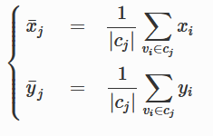

# Logistic Routing Problem


## Tujuan Tugas
1. Review materi pathfinding pada mata kuliah Strategi Algoritma.
2. Mengenal multiple-agent TSP.
3. Melakukan visualisasi data.

## Deskripsi Masalah
Welcome to **Oldenburg** ! Kota kecil cantik ini merupakan sebuah kota kecil di barat lau kota Bremen , Jerman , dengan penduduk kurang lebih 168 ribu jiwa [2018]. Kota kecil ini cocok menjadi lahan uji coba untuk melakukan pemodelan sederhana pembuatan rute pengantaran logistik.<br>
Setiap beberapa jam sekali, sebuah perusahaan logistik akan mengirimkan beberapa kurirnya untuk mengantar barang dari kantor pusat mereka ke beberapa titik tujuan yang tersebar di penjuru kota Oldenburg. Anda diminta untuk mencari rute untuk seluruh kurir sehingga jarak yang ditempuh oleh semua kurir paling kecil, sehingga perusahaan logistik dapat menghemat biaya bensin.

## Multiple-Agent TSP
Masalah pengantaran barang untuk satu kendaraan dengan fungsi objektif jarak minimal dapat dimodelkan oleh Travelling Salesman Problem. Akan tetapi, perusahaan logistik biasanya memiliki lebih dari satu kendaraan yang berangkat bersamaan, sehingga TSP kurang cocok digunakan. Generalisasi TSP untuk beberapa agen adalah **multiple-agent TSP (mTSP)**, dan model masalah ini akan kita gunakan. Pada mTSP, akan terdapat *m* tur yang akan dibangun. Syarat dari semua tur mirip dengan TSP, yaitu bahwa seluruh tur akan kembali ke simpul awal (mewakili kantor pusat) dan setiap tujuan hanya akan dilewati oleh satu tur.

## Algoritma Untuk Pathfinding
Algoritma pathfinding yang digunakan adalah algoritma **dijkstra**. Algoritma ini mengunakan pendekatan algoritma greedy. Pada setiap langkah, ambil sisi yang berbobot minimum yang menghubungkan sebuah node yang sudah terpilih dengan sebuah node lain yang belum terpilih. Lintasan dari simpul asal ke simpul yang baru haruslah merupakan lintasan yang terpendek diantara semua lintasannya ke simpul-simpul yang belum terpilih. Dengan algoritma ini kita dapat memperoleh jarak dari suatu node ke seluruh node lainnya pada graf. 

## Pendekatan Penyelesaian mTSP
Dalam menyelesaikan persoalan mTSP, saya menggunakan pendekatan heuristik, yaitu melakukan **city clustering dengan algoritma K-Means yang sudah diimprovisasi**. Misalnya terdapat n titik dan m kurir, city clustering ini bertujuan untuk membagi titik-titik lokasi pada kota menjadi m buah cluster secara proporsional. Pembagian cluster dilakukan berdasarkan koordinat titik yang diukur berdasarkan jarak Euclediannya, sehingga untuk setiap cluster, akan memuat paling banyak Q = ⌈n/m⌉ titik. Awalnya centroid untuk setiap cluster adalah m titik yang dpilih secara random, lalu dicari maksimal Q titik dengan jarak eucledian terdekat untuk setiap centroid. Nilai centroid akan di-update dengan formula berikut:<br>
<br>
Langkah akan diulangi hingga diperoleh kekonvergenan, yaitu ketika posisi koordinat seluruh centori sudah tidak berubah lagi.
<br>
<br>
Selanjutnya dilakukan penyelesaian TSP untuk masing-masing cluster. Penyelesaian TSP dilakukan dengan 2 metode, yaitu algoritma branch and bound dan optimasi menggunakan library MIP dari python.

### Branch and bound
Pendekatan Branch and Bound yang digunakan adalah dengan bobot tur lengkap. Awalnya akan dihitung nilai lower bound untuk simpul start dengan formula sebagai berikut:<br>
<br>
Selanjutnya akan diekspan ke seluruh simpul lainnya yang belum dikunjungi untuk dihitung nilai costnya juga dengan formula yang sama. Dipilih simpul dengan nilai cost terkecil untuk diekspan selanjutnya. Jika semua simpul sudah dikunjungi, akan diperoleh nilai cost terkecil sebagai solusi.

### Optimation using MIP Library
Optimasi pencarian solusi TSP dilakukan dengan menggunakan library MIP dari python. Model memiliki objektive untuk meminimalkan jarak yang ditempuh dengan batasan bahwa setiap titik hanya dikunjungi satu kali. MIP akan mengoptimasi pencarian TSP dengan **mengeliminasi subtour**, sehingga tour yang dihasilkan langsung memuat seluruh titik dan memiliki bobot minimum.

## Getting Started
### Prerequisites
1. Python 3
2. library mip<br>
dapat diinstal dengan perintah berikut di cmd
```
pip install mip
```
3. library networkx<br>
dapat diinstal dengan perintah berikut di cmd
```
pip install networkx
```
4. library matplotlib<br>
dapat diinstal dengan perintah berikut di cmd
```
pip install matplotlib
```

## Running the Program
1. Buka cmd di folder src
2. ketikkan perintah berikut di cmd
```
py main.py
```
3. Program utama sudah dieksekusi

## Testing
1. Masukkan pilihan kota yang ingin diuji
2. Masukkan pilihan metode penyelesaian TSP
3. Masukkan n wilayah pada kota yang merupakan daerah tujuan pengantaran paket
4. Masukkan sejumlah n id wilayah tujuan pengantaran paket (harus berbeda)
5. Masukkan id wilayah kantor pusat pengiriman barang, harus berbeda dari n wilayah tujuan sebelumnya (disarankan merupakan wilayah yang strategis, berada di tengah kota)
6. Masukkan jumlah kurir
7. Hasil akan ditampilkan


## Refrensi
[1] Dataset : https://www.cs.utah.edu/~lifeifei/SpatialDataset.htm<br>
[2] Pengenalan dan formulasi mTSP : https://neos-guide.org/content/multiple-traveling-salesman-problem-mtsp<br>
[3] MIP , pustaka Python untuk optimisasi : https://python-mip.readthedocs.io/en/latest/intro.html<br>
[4] Li, Feifei, Dihan Cheng, Marios Hadjieleftheriou, George Kollios, and Shang-Hua Teng. "On trip planning queries in spatial databases." In International symposium on spatial and temporal databases, pp. 273-290. Springer, Berlin, Heidelberg, 2005.<br>
[5] Dijkstra Algorithm : https://www.geeksforgeeks.org/python-program-for-dijkstras-shortest-path-algorithm-greedy-algo-7/<br>
[6] K-Mean Algorithm : https://link.springer.com/article/10.1007/s00500-017-2705-5 <br>
[7] TSP using Branch and Bound Algorithm : https://www.geeksforgeeks.org/traveling-salesman-problem-using-branch-and-bound-2/ and http://informatika.stei.itb.ac.id/~rinaldi.munir/Stmik/2017-2018/Algoritma-Branch-&-Bound-(2018).pdf<br>
[8] MIP in Modelling TSP : https://python-mip.readthedocs.io/en/latest/examples.html <br>
[9] Draw directed graph in Networkx : https://stackoverflow.com/questions/20133479/how-to-draw-directed-graphs-using-networkx-in-python 

## Credits
Thank you for Li Fei Fei et. al. for providing the data.

## Author
Anna Elvira Hartoyo - 13518045
